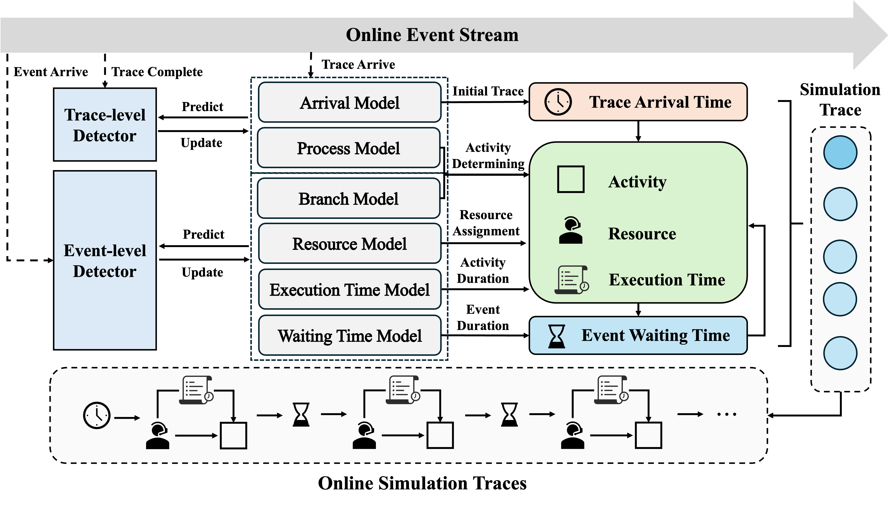

# MDSA-OPS

Code for the paper submitted to CAiSE 2026 on multi-source drift-aware online process simulation.

---

## Installation

### 1. Create a Python environment

We recommend using Conda:

```bash
conda create -n obps python=3.11
conda activate obps
```
### 2. Install Python dependencies
```bash
pip install -r requirements.txt
```

## Data Preparation

Place your event streams under the streams/ directory and specify the corresponding data_path in the configuration file.

- The repository currently provides the event streams used in our experiments.
- You can add your own streams by placing them in streams/ and updating the config accordingly.

## 	Configuration
Model and experiment settings are specified in YAML files under the configs/ directory.

Key parameters include:
- data_path: path to the input event stream.
- process_fitness_threshold: fitness threshold for the process model N.
- process_error_threshold: error threshold for the branch model $P_B$.
- arrival_error_threshold: error threshold for the arrival model A.
- res_error_threshold: error threshold for the resource model R.
- wt_error_threshold: error threshold for the waiting-time model W.
- et_error_threshold: error threshold for the execution-time model E.


## Running
Once the configuration file is prepared, run:
```bash
python OnlineSimulation.py
```
By default, the script will:
1.	Load the YAML configuration from configs/.
2.	Read the event stream from data_path (under streams/).
3.	Perform multi-source drift-aware online process simulation and output evaluation results.

## Model Architecture
The overall architecture of MDSA-OPS is illustrated in the following figure.


## Experimental Results
The overall performance comparison between baseline methods and OURS is summarized below.  
Lower values indicate better alignment between simulated and real behavior (smaller distance).  
(Control-flow: NGD, CFLD; Temporal: AED, CAD, CED, RED, CTD; Workforce: CWD.)

| Event Log  | Method    |   NGD  |  CFLD  |    AED    |    CAD    |  CED  |   RED   |   CTD    |  CWD  |
|-----------|-----------|-------:|-------:|----------:|----------:|------:|--------:|---------:|------:|
| **BPIC12W** | SIMOD[1]     | 0.250  | 0.274  | 1251.559  | 1314.318  | 5.079 |  62.610 | 131.025  | 4.426 |
|           | AgentSim[2]  | 0.320  | 0.343  | 1500.402  | 1654.119  | 3.846 | 162.442 | 280.662  | 3.657 |
|           | OBPS[3]      | 0.234  | 0.327  | 274.896   | 114.320   | 2.513 |  66.424 |  83.840  | 3.285 |
|           | **OURS**  | **0.109** | **0.100** | **114.423** | **35.264** | **1.261** | **45.434** | **37.983** | **1.521** |
| **BPIC17W** | SIMOD     | 0.257  | 0.184  | 860.145   | 861.299   | 4.380 |  36.702 |  73.045  | 4.056 |
|           | AgentSim  | 0.147  | 0.139  | 1337.698  | 1360.753  | 2.417 |  67.525 | 101.322  | 2.732 |
|           | OBPS      | 0.356  | 0.418  | 314.311   | 381.286   | **1.427** |  54.129 |  90.305  | 2.042 |
|           | **OURS**  | **0.140** | **0.126** | **256.534** | **58.013** | 1.659 | **32.232** | **57.812** | **1.765** |
| **ACR**     | SIMOD     | 0.250  | 0.164  | 856.832   | 856.046   | 3.272 |  83.640 | 240.823  | 3.308 |
|           | AgentSim  | 0.246  | 0.186  | 391.468   | 353.958   | 5.268 | 118.395 | 334.011  | 4.846 |
|           | OBPS      | 0.656  | 0.413  | 151.373   |  67.808   | **1.393** | 103.558 | 223.030  | **1.478** |
|           | **OURS**  | **0.164** | **0.100** | **107.171** | **21.125** | 1.841 | **46.720** | **138.209** | 1.901 |
| **Production** | SIMOD | 0.669  | 0.567  | 1822.346  | 1786.794  | 4.456 |  59.573 | 137.325  | 4.481 |
|           | AgentSim  | 0.615  | 0.566  | 512.280   | 501.273   | 3.680 |  83.232 | 159.661  | 3.757 |
|           | OBPS      | 0.729  | 0.627  | 192.750   | **23.005**| 1.706 | **45.385** | 172.162 | 1.759 |
|           | **OURS**  | **0.455** | **0.439** | **156.432** | 40.886   | **0.940** | 52.953 | **69.772** | **0.814** |

The simulation logs generated by our method are provided in the log_results/ directory.
## References

[1] Camargo M, Dumas M, González-Rojas O. Automated discovery of business process simulation models from event logs. Decision Support Systems, 2020, 134: 113284.  
Code: <https://github.com/AutomatedProcessImprovement/Simod>

[2] Kirchdorfer L, Blümel R, Kampik T, et al. Agentsimulator: An agent-based approach for data-driven business process simulation. 2024 6th International Conference on Process Mining (ICPM). IEEE, 2024: 97-104.  
Code: <https://github.com/lukaskirchdorfer/AgentSimulator>

[3] Vinci F, Park G, Van Der Aalst W M P, et al. Online Discovery of Simulation Models for Evolving Business Processes. International Conference on Business Process Management. Cham: Springer Nature Switzerland, 2025: 451-468.  
Code: <https://github.com/franvinci/ProcessSimulationTool>